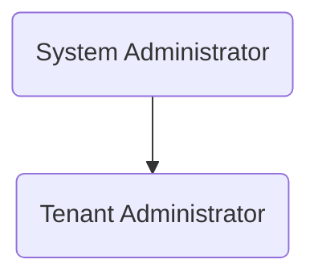
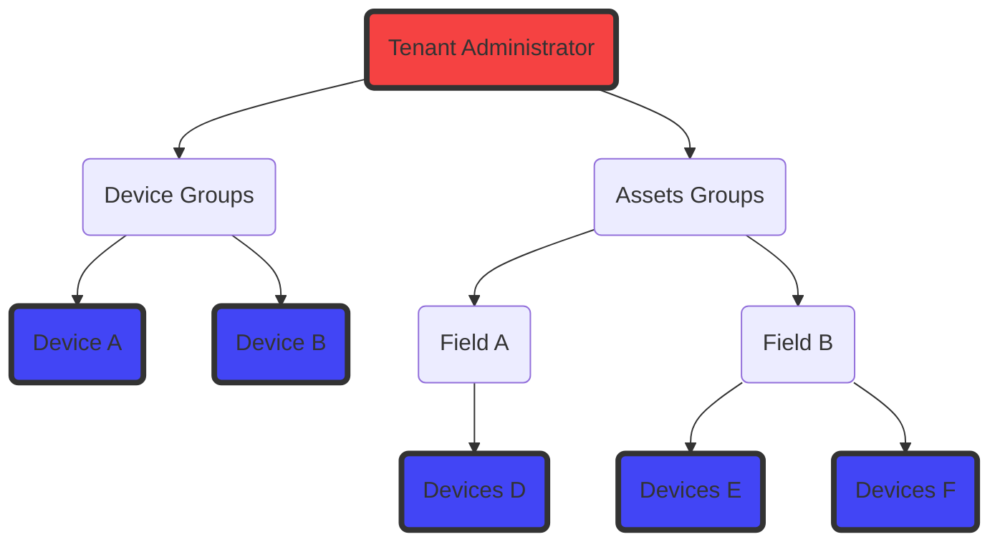
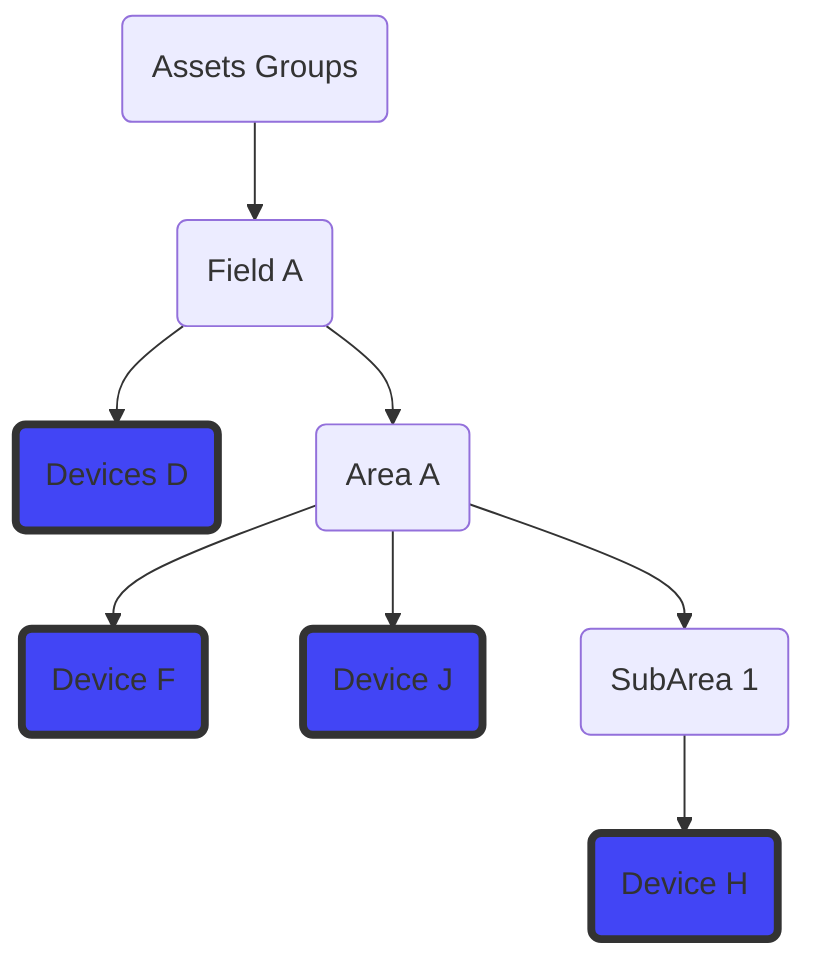
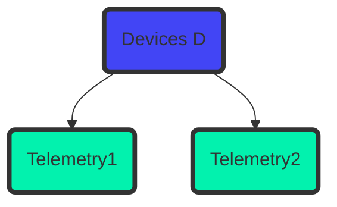
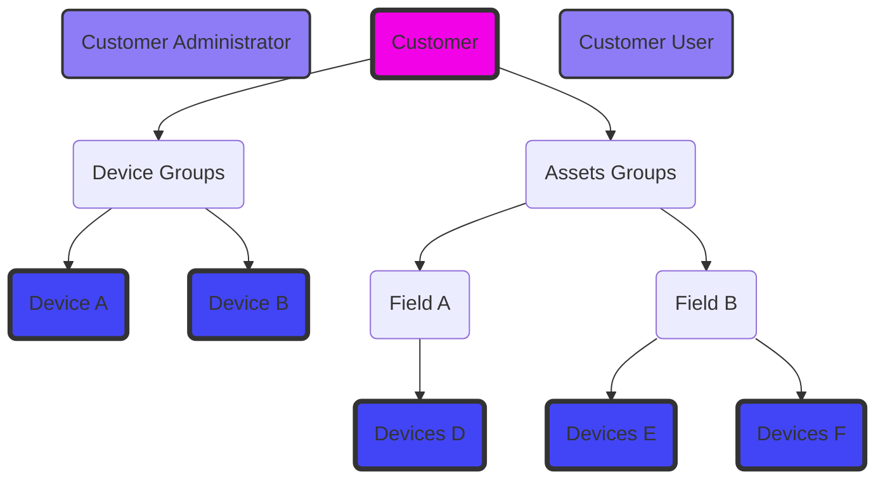
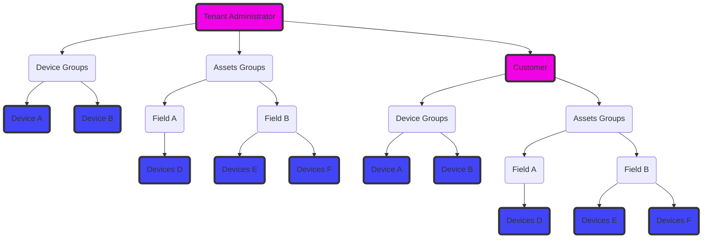

# 3 Pro Introduction. 


The Troodos Mountains are the green heart of Cyprus. The mountains capture and manage the rains that form our natural water resources. Agricultural dry-stone terraces, rural communities and forests shape the diverse landscape of Troodos. The agricultural and food processing sectors in the Troodos Mountains have high potentials but also face many challenges.

The 3PRO-TROODOS Project is an Integrated Research Project (2019-2022), funded by the Research and Innovation Foundation of Cyprus, and coordinated by The Cyprus Institute. The project aims to improve agricultural production and food processing in the Troodos Mountains of Cyprus, through social innovation, sustainable natural resource management and climate change adaptation.

The 3PRO-TROODOS Consortium conducts research, in cooperation with the agri-food producers and processors of the Troodos Mountains, to achieve:

- A quality certification label for Troodos food products
- Improved fruit tree production with protective nets
- New products and practices for local herbs
- Maintenance and rehabilitation of agricultural dry-stone terraces
- Improved irrigation water use with wireless sensors and mobile Apps
- Guidelines for sustainable water use under current and future climate conditions
- Insights in the socioeconomic impact of quality labelling on Troodos

# General Information. 

To perform the necessary research a number of wireless sensors had to be used to take various measurements of the state of the soil as well as the environmental conditions in an area. To keep all these data easily accessible, a sensor observation IoT platform had to be developed. 

On the Sensor Platform, device entities of type "3Pro Device" can be added. This device entity will record the sensor data that is transmitted from the device, and will post process the data accordingly to give some predictions. But for the data to be post processed successfully some specific parameters about a device must be set correctly. 

For more information about the platform and well as installation instructions refer to the relevant repository of the platform.

This version of the platform uses an open source version of a platform (thingsboard) as a base, which offers great levels of configurability, scalability and security. The rest of the 3pro functionality has been build on top of that platform using extensive rules, custom dashboards, and widgets. 


The following document contains instructions about how to setup the 3d pro platform, as well as explainations, terminology, etc. 

There are also several repositories with utility tools that can be used to simplify the device configuration and other stuff. 

## Theory of operation 

TODO. 

## Terminology.

The platform follows a very complicated paradigm for user and device management so a lot of explanation is needed 

### Terminology related to the user management.

* Users
* System Administrator
* Tenant administrator
* Assets
* Devices
* Telemetry
* Entities
* Dashboards
* Customers
* Customer Users and Customer Administrators.


1. A user is a user of the platform. It can be a System administrator, tenant administrator, A customer User Or A customer administrator.

2. System Administrator is a user which is the owner of the thingsboard installation. He has access to all system resourses, and the tenant administrators.



2. The Tenant administrator 
   
   The Tenant administrator is a user that has access to tenants (hereby called customers), and can view manage and create dashboards, assets, customers, sub users, add devices etc. 

   To simplify, assuming that there is not another sub customer at play, the Tenant administrator on his own, can be thought as a owner of devices. The device themselves can be orphaned, or they can belong to an asset.



3. Assets. Assets is just a way to group devices that belong to specific locations. There is no limit on how many assets and devices can be nested. For example, a building as a whole can have X apartments with Y devices each, and the full building can have additional Devices. How the relations are devined will be described later in this document.




4. Devices. Devices are devices inteties that contain sensors, which send telemetry data. For example Argus hub its a device that contains X amount of sensors and transmits Y amount of telemetry. In thingsboard sensors dont matter. They dont have any representation and its only the telemetry that matters. 



The telemetry entries are called attributes. There 2 type of attributes. The Server attributes, and the Telemetry attributes. More information about them will be described later in this document.

5. Telemetry is the measurements that are transmitted from the devices.


6. Dashboards 

A dashboard is an interface that displays information about devices. 


A dashboard can be static or dynamic, get entries from groups etc. List all devices belonging in a user, etc. At the same time a dashboard can be shared with multiple users, assuming that they have been configured correctly to pull the information about the devices of individual users.
Dashboards can have also seperate `states`. A `dashboard state` is a dashboard configuration which can be configured to display different things depending the selected device or something similar. more information about the use of `dashboard states` will be referenced on the tutorial about how to set a dashboard for multiple device types.


7. Customers. A customer (or tenant) is an entity that (like the tenant administrator), can own devices, assets, dashboards etc.





By default a customer is just business entity. This means that it can own devices assets etc, but by default it doesn't have any users. The Customer entity need to have a "customer user", a "customer administrator" or both.


The customer can belong To the Tenant Administrator, and the customer in turn can have extra subcustomers, etc




# Installing the platform. 

## Prerequisites

This guide describes how to install ThingsBoard on Ubuntu 18.04 LTS / Ubuntu 20.04 LTS. Hardware requirements depend on chosen database and amount of devices connected to the system. To run ThingsBoard and PostgreSQL on a single machine you will need at least 1Gb of RAM.

### Step 1. Install Java 11 (OpenJDK)
ThingsBoard service is running on Java 11. Follow this instructions to install OpenJDK 11:

```
sudo apt update
sudo apt install openjdk-11-jdk
```

Please don’t forget to configure your operating system to use OpenJDK 11 by default. You can configure which version is the default using the following command:

```
sudo update-alternatives --config java
You can check the installation using the following command:
```
```java -version```
Expected command output is:


```bash
openjdk version "11.0.xx"
OpenJDK Runtime Environment (...)
OpenJDK 64-Bit Server VM (build ...)
```
### Step 2. ThingsBoard service installation
Download installation package.

```
wget https://github.com/thingsboard/thingsboard/releases/download/v3.4.1/thingsboard-3.4.1.deb
```

Install ThingsBoard as a service

```sudo dpkg -i thingsboard-3.4.1.deb```

### PostgreSQL Installation
Instructions listed below will help you to install PostgreSQL.

```bash
# install **wget** if not already installed:
sudo apt install -y wget

# import the repository signing key:
wget --quiet -O - https://www.postgresql.org/media/keys/ACCC4CF8.asc | sudo apt-key add -

# add repository contents to your system:
RELEASE=$(lsb_release -cs)
echo "deb http://apt.postgresql.org/pub/repos/apt/ ${RELEASE}"-pgdg main | sudo tee  /etc/apt/sources.list.d/pgdg.list

# install and launch the postgresql service:
sudo apt update
sudo apt -y install postgresql-12
sudo service postgresql start
```
Once PostgreSQL is installed you may want to create a new user or set the password for the the main user. The instructions below will help to set the password for main postgresql user

```bash
sudo su - postgres
psql
\password
\q
```

Then, press “Ctrl+D” to return to main user console and connect to the database to create thingsboard DB:


```bash
psql -U postgres -d postgres -h 127.0.0.1 -W
CREATE DATABASE thingsboard;
\q
```

ThingsBoard Configuration
Edit ThingsBoard configuration file

```sudo nano /etc/thingsboard/conf/thingsboard.conf```

Add the following lines to the configuration file. Don’t forget to replace `PUT_YOUR_POSTGRESQL_PASSWORD_HERE` with your real postgres user password:

```bash
# DB Configuration 
export DATABASE_TS_TYPE=sql
export SPRING_DATASOURCE_URL=jdbc:postgresql://localhost:5432/thingsboard
export SPRING_DATASOURCE_USERNAME=postgres
export SPRING_DATASOURCE_PASSWORD=PUT_YOUR_POSTGRESQL_PASSWORD_HERE
# Specify partitioning size for timestamp key-value storage. Allowed values: DAYS, MONTHS, YEARS, INDEFINITE.
export SQL_POSTGRES_TS_KV_PARTITIONING=MONTHS
```

### Run installation script
Once ThingsBoard service is installed and DB configuration is updated, you can execute the following script:


```sudo /usr/share/thingsboard/bin/install/install.sh```

### Start ThingsBoard service
Execute the following command to start ThingsBoard:

```sudo service thingsboard start```

Once started, you will be able to open Web UI using the following link:


```http://localhost:8080/```

The following default credentials are available if you have specified –loadDemo during execution of the installation script:

```
System Administrator: sysadmin@thingsboard.org / sysadmin
Tenant Administrator: tenant@thingsboard.org / tenant
Customer User: customer@thingsboard.org / customer
```

You can always change passwords for each account in account profile page.

Please allow up to 90 seconds for the Web UI to start. This is applicable only for slow machines with 1-2 CPUs or 1-2 GB RAM.


# Setting up the 3pro platform

For the platform to work correctly, various dashboards and settings must be imported. 


## Importing Rule Chains

Press `Rule Chains` and press the `+` symbol. Then press on the `Import rule chain`


import the file `3pro_rule_chain.json` which can be found under `Rule Engine` folder on this repository. 


The rule chain `3pro` should appear on the list


Press on top of the rule chain name and on the resulting page press the button `copy rule chain id` 


This will copy the rule chain unique id which will look something like that
`99f7cc50-59e5-11ed-a89c-13427b0e0a64`


Additional information about how the rule chain works can be found on the following readme:

[Rule Chain Documentation](https://github.com/sigintsolutions/3ProTroodosV2-Introduction/blob/master/Rule%20Engine/platform%20rule%20chain%20post%20processing%20documentation.md)


## Importing device profiles

Navigate on the `Device profiles` folder, and edit the `3pro_Device.json` via a text editor. 

Replace the `"id"` with the rule chain id that was copied on the previous step. 


Save and close the document. 

 On the platform, press on the `Device Profiles` and press the `+` symbol. 


Press the button `Import Device Profile`


on the new tab that will open drop the `3pro_Device.json`.


and press import . 

The imported device profile should appear in the device profile list.


## Importing Widgets

Press on the `Widgets library` button, then on the `+` symbol, and finaly on the `Import widgets bundle`

On the new page select the file `3proWidgets.json` which can be found in the `widgets` folder in this repository. 


and press `import`.

The widgets should appear on the widget packages list


## Importing dashboards

To import the dashboard, press on the `Dashboards` button on the left, then press the `+` symbol, and finaly on the `import dashboard`


Import the files `3Pro-Agents-Developers-General-Dashboard.json` and the file `3Pro-General-Simplified.json.`

The dashboards should appear on the Dashboards list. 


To open a dashboard you can press on the following symbol as indicated on the picture


though at this point there are no devices installed


# Setting up the platform (part B)

Besides the general setup that was described above, 

## Adding devices. 

To add a 3pro device, press on the `Devices` button, then on the `+` symbol, and finally on the `add new device`


Name the device with a suitable unique name, and select the correct device profile which should be `3Pro Device`. Without it the  post processing chain 


Press `add` to finish the device installation.

On the new device on the list press on the device name.
A new page will open with some details about the device. 

2 very important tabs in this new page is the `Attributes` `(1)` as well as the `Latest Telemetry` `(2)`


`Attributes` are device attributes that can be used from the server for postprocessing the transmitted data, and `Latest Telemetry`  is displaying the latest telemetry that was received from the device.  Information about the device configuration and well the transmission method will be described later in this document. 


## Connecting devices

On the new device on the list press on the device name.
A new page will open with some details about the device. 

The most important button at this point is the `Copy access token`. This will copy on the clipboard a token in the following form `NWYs8rdilrTq8JZsWB31`. 
This will be used by the device to transmit the data and  will be referred to later as $ACCESS_TOKEN


### Connectivity Options. 
The device can be connected either via `Mqtt` or via `Http` requests. 

MQTT is a lightweight publish-subscribe messaging protocol which probably makes it the most suitable for various IoT devices

#### MQTT Connect

To connect the application needs to send MQTT CONNECT message with username that contains $ACCESS_TOKEN.

Possible return codes, and their reasons during connect sequence:

```
0x00 Connected - Successfully connected to ThingsBoard MQTT server.
0x04 Connection Refused, bad username or password - Username is empty.
0x05 Connection Refused, not authorized - Username contains invalid $ACCESS_TOKEN.
```

In order to publish telemetry data to ThingsBoard server node, send PUBLISH message to the following topic:
```v1/devices/me/telemetry```

#### Http connect


HTTP is a general-purpose network protocol that can be used in IoT applications. You can find more information about HTTP here. HTTP protocol is TCP based and uses request-response model.

In order to publish telemetry data to ThingsBoard server node, send POST request to the following URL:

```http(s)://host:port/api/v1/$ACCESS_TOKEN/telemetry```


### Device format. 

The simplest supported data formats are:

For a single telemetry point: 

```json
{
    "key1":"value1", 
}
```

For multiple telemetry points
```json
{
    "key1":"value1", 
    "key2":"value2"
}
```
In this case the server-side timestamp will be assigned to the uploaded telemetry. For the calculations to be performed correctly, all the measurements for each measurement cycle of the device must be transmitted at the same time, so all the transmissions have the same timestamp. 

In case this is not possible, or in case that historical data must be transmitted, the following format is also possible. 

```json
{
    "ts":1451649600512, 
    "values": {
        "key1":"value1", 
        "key2":"value2"
    }
}
```

In the example above, we assume that “1451649600512” is a unix timestamp with milliseconds precision. For example, the value ‘1451649600512’ corresponds to ‘Fri, 01 Jan 2016 12:00:00.512 GMT’


#### Mqtt transmission example. 

To demonstrate the above, below its an example transmission from a windows machine. 


and the resulting telemetry on the device page, `latest telemetry`


## Initializing devices. 

As mentioned multiple times in this document, for the 3pro postprocessing to work correctly, a list of server attributes must be set on the device. These can be configured on the device either from the device dashboard itself, or using the 3proConfigurator Application which can be found on another repository. 


### Required parameters. 
A new device needs the following parameters. 


* `dischargeRate`: Discharge of the irrigation supply system (one or more drippers or sprinklers) over the specified field area in L/h
* `elevation`: The elevation of the of the location of the device. Right now it is not used in any calculation. 
* `enableBatteryAlarm`: Boolean values that controls if the creation of alarms for low battery on the device will be active. 
* `batteryLimit`: The value that will act as a limit to trigger the `batteryAlarm`
* `enableInactivityAlarm`: Boolean value that control the creation of alarm for device inactivity. If `true` inactivity alarm will be triggered when the device doesn`t send any information in a time period larger than `inactivityTimeoutMinutes`
* `fieldCapacity`: Volumetric soil water content after 24-48 hour drainage of saturated soil (cm3_water/cm3_soil), expressed as percentage, e.g., 24
* `fieldName`: name of the field
* `latitude`: The latitude of the device location in decimal degrees(ddg)
* `longitude`: The longitude of the device location in decimal degrees(ddg)
* `soilMoistureThreshold`: The threshold that will be used to display warning message on the soil moisture. 
* `wettedArea`: The area wetted by the irrigation system (m2). This area should be smaller than the field area, unless the whole field is flooded. 
* `wiltingPoint`: ASK ADRIANA
* `fieldArea`: This is the field area (m2) used for the irrigation system discharge. It could be the area of the full field, of a terrace, or of a single tree. 
* `inactivityTimeoutMinutes`: is used with conjuction with `enableInactivityAlarm` to trigger an alarm. 
* `rainPerTick`: in case a device has water tipping bucket, this is used to calculate the actual value of the rain. 
* `cropCoefficientInitial`: Crop coefficient at the start of green up (trees) or between planting and 10% field cover (field crops). The crop coefficients are used for checking the irrigation water needs. 
* `cropCoefficientMid`: Crop coefficient for the full maturity stage, starting from near full canopy cover till the aging of the leafs (drying, yellowing).  
* `cropCoefficientEnd`: Crop coefficient at the end of the growing season when transpiration stops, such as leaf drop (trees) or harvest (field crops).
* `dayStartInitialStage`: For field crops from planting to 10% field cover, can be skipped for trees, so date is same as start development stage
* `dayStartDevelopmentStage`: For field crops at 10% cover, for trees at leaf out
* `dayStartMidSeason`:  Start of effective full cover (70-80%) or heading/flowering for field crops
* `dayEndMidSeason`: Start of crop maturity or leaf drying/coloring
* `dayEndLateSeason`: For field crops at harvest, for trees start of leaf drop, end of irrigation season
* `transmissionDuration_m`: the logger trasmits telemetry in a predetermined period. This value is used to determine that sensors have transmitted at that predetermined period. This is not related to the inactivity alarm, because the logger maybe active, with some of the critical sensors being faulty. 
* `nameOfTemperatureKey`: the name of the telemetry key that is used to calculate the min, max, and mean temperatures. This is used because there is a possibility that the logger has more than one temperature sensors, so a way is needed to differentiate the temperature telemetry kies. 
* `nameOfHumidityKey`. Similarly but for the humidity. 
* `tempLowLimit`: A temperature threshold. Temperature values lower than that threshold will trigger an alarm to the user. Indicating that the sensor may be faulty (for example if the sensor indicates -50 °C), or, depending on the settings, some extreme conditions that the owner of the logger wants to monitor (for example if the limit was set at -0°C) the soil will be damaged by frost. 
* `tempHighLimit`: A high temperature threshold. Similar to the above description. 
* `humidityLowLimit`: Similarly but for low  humidity threshold
* `humidityHighLimit`: Similarly but for high humidity threshold
* `soilMoistureLowLimit`: Similarly but for low soil moisture threshold
* `soilMoistureHighLimit`: similarly but for high soil moisture threshold
* `soilTemperatureLowLimit`: similarly but for low soil temperature threshold. 
* `soilTemperatureHighLimit`: similarly but for high soil temperature threshold
* `fcErrorMargin`: 
* `etcErrorMargin`:
* `fieldConfiguration` field configuration is a JSON structure that holds information about which telemetry keys are used for the calculation of the soil moisture properties. This is used because for the calculation, each sensor needs additional information that needs to be configured and to be used on the calculation, like the sensor depth. that way the sensor names can be used as variables. 

### Using the 3 Pro field configurator. 
3 Pro field configurator has been developed, to make the initial configuration of a device easy to a user / agent / researcher. 

Example of using the application. 


Further instructions can be found on its specific application repository. 

A sample settings file, that can be loaded directly on the 3pro field configurator can be found on this repository under the folder `Settings Sample`

### Using the Dashboard.

Instructions of using the dashboard for the initial configuration of the device can be found on the next chapter. 

## The 3 pro dashboard. 

After devices with the correct type have been installed in the platform, they will be displayed in the dashboard pages. 


Warning: The device will only be displayed if it is the correct device type. 

Clicking on top of the device name will transition to another dashboard page with a lot of information about the device, charts, etc. 

The following dashboard page has various data that are displayed. 

On the top of the page, there is the name of the dashboard, the name of the device, an the time-range that is displayed in the dashboard. On the following example data that have been transmitted from the device for the last 7 days will be visible. 


This time can be modified accordingly and all the charts will update to accommodate that new time range. 


On the first portion of the dashboard, we have the map display., a list of warning panels, the configuration panel, and finally some fields with the values that have been configured for that particular device. 


Thes section has environmental information as well as Charts for soil temperature and soil moisture. 


On this section we have the same information as the above, but in a table format. An additional chart is also on this section with the calculated soil average from all the sensor (which is processed from the rule engine.)


This section has values that have calculated for each day, like the minimum and maximum temperature for the previous day, etc. 


Finally this section has device error codes that can be used with ARGUS IOT logger, as well as alarms relevant to the device. 


---
Besides the main screen, most widgets have additional information that can be displayed by pressing on the `...` symbol on top of the widget (if it exists)


This will transision to another dashboard state with more information and charts about that particular telemetry


Similarly the device can be configured by pressing on the `...` symbol on the top of the red `configure device` widget. 


This will transision to an additional dashboard page where the required values for that device can be put, as was described on the section `Required parameters.`


while populating the relevant values, these will be displayed on the `Field inform` widget. 
Any calculated values that are derived from the data are calculated immidiately and are displayed on the `Calculated Values` card


### Names of the keys for the dashboard. 

While the name of the keys of critical values for the rule engine can be adjusted on the configuration, this is not the case for the keys that are displayed on the dashboard. 

On the list below its a list of the default keys that are used on the dashboard. 

```
'Altitude'
'Ambient Temperature'
'Atmospheric Pressure'
'Battery Percentage'
'Battery Voltage'
'Humidity'
'Luminosity'
'Pressure'
'Pulse 0 Ticks'  //For rain measurements
'Relative Humidity'
'Soil Temperature ##' //Soil temperature 01 - 06
'Soil Vol Water Content ##' //Soil moisture 01 - 06
'Vapor Pressure'
```

In case different keys names are going to be transmitted from the device, and change is not possible, then these keys must be modified on the dashboard. 

To modify the keys for a widget, enter edit mode


Press the `pencil` icon on the widget


Press the `pencil` icon again on the key name


and change the `key` on the new page. 


### Example

To give a more concrete example the following dashboard is from an already configured device that already transmits data. 


As its visible from the picture, the map displays the location of the device. 

Additionally the calculations display a message on widget `(1)`, with `Yes` or `No` if the farmer needs to irrigate. 

Even if the answer is `NO`, it will still display on widget `(2)` the calculated time for the irrigation. In the case of the example, the farmer should irrigate for 0.27 time, but, at least for the time being, the moisture soil levels are not low enough to warrant the irrigation. 

Widget `(3)` displays the following messages if they are applicable
```
Kc too low or WA_fraction too large.
Kc to High or WA-Fraction too small.
```

Finally on widget `(4)` a warning 
```Drainage losses, reduce irrigation duration``` will be displayed if the farmer over-irrigates the field. 


This particular field has 6 soil sensors. On the first chart with can see the chart for the temperature of the soil in this 6 particular sensors. 
On the right we can see another chart which show the soil moisture levels for the same 6 sensors. 


On the next section we have the `Soil Moisture Table` which shows the soil moisture measurements for each sensor. The soil average for the field can be calculated only if the measurements all the sensors on the field are available at the same time.

In any case, the soil average plot is displayed on the chart to the right. 


On the next section we have all the values that are reported once per day


## Creating farmer entities and assigning devices. 

Tenant has the ability to create device and modify dashboards. 
This should not be the case for a single farmer that just needs to see his soil moisture levels and get some warnings. 

A farmer `customer` entity can be created with the following way. 

Press on the button `Customers`, then press on the `+` symbol. 


On the new page add the relevant information for the farmer. The only mandatory field is the `Title`
Then press `Add` to complete the process. 


To add a user to this new customer press on the `manage customer User` icon


On this press on the `+` symbol and on the new page, add the relevant `email` and press `Add`


This will create a new activation link which can be used by that customer. 


After the activation link has accessed a new page will be displayed, so that the user can create a new password. 


On the tenant side of things, to assign the device to that 
customer, press on the `devices` tab
Then press the button `Assign to customer`


Similarly the dashboard must also be assigned to the customer. 

to do that press on the `Dashboards` Tab, then press on the dashboard that needs to be shared. 

In this case the Simplified dashboard will be shared with the user. 
To do that press on the `manage assigned dashboards` button


And on the new page, select the customer name from the entity list. 


After the dashboard is assigned to customer, it can be assigned as the default dashboard, so it can be displayed directly at his home screen when he logins on the platform.


To do this, press on the `customers` when logged in as a tenant. 

Then press on the `name` of the farmer, and on the new page that will open press the `percil` icon to edit the details of the customer.


On the section `Home Dashboard` select the dashboard name, and disable the check box `Hide home dashboard toolbar`


The farmer should be able to access his devices from the device list, and see his data from the dashboards. 


If a default dashboard was selected for that user, then it will be immidiately visible on the `Home` tab


Alternative if a default dashboard wasn't selected, the dashboards can be found on the `Dashboards` tab. 

---
## Downloading Data. 


To reduce the potential for abuse the source code for that particular tool is not provided, as it can be used to perform DoS attacks to thingsboard installations. 

The downloader application can be found on the following repository [3pro Data Downloader](https://github.com/sigintsolutions/3Pro-Data-Downloader)

To download data run the thingsboard Data Downloader and input the necessary credentials. 

After logging in, a list of the available devices will be available.

Select one or more devices, and select the time range. 


Press the download data, 

*Warning*: The download process can take up to 30 minutes to complete for devices with a lot of data and extended time ranges. (ie 2 years of data)


# Description of the rest of the utility applications. 

## Data post processor application. 

The 3 pro data post processor has been developed to give the researcher the ability to process the data from a field that is monitored retroactively, using different settings.

The data post processor can be found on the following link. [Data Post Processor](https://github.com/sigintsolutions/3pro-data-post-processor)

During normal operation of the platform, every data point that is transmitted is used to calculate the status of the soil and is used to make predictions. For these calculations to work the devices must be correctly configured using specific server attributes. For the specific server attributes as well as description of them refer to 3 pro field configurator git, as well on the main project git.

The problem with that is that if a researcher changes one of the server attribute, this will only be taken into effect after the point where the value changed. While this functionality could have been added in the platform, irresponsible use of this functionality (especially if a device has data points going back years), will put a major strain on the server.

This application solves this issue by running calculations on a local, downloaded copy of the data (as described on the section about downloading data.)

---
## Device configurator application. 

3 Pro field configurator has been developed to make the initial configuration of a device easy to a user / agent / researcher. 

To perform the necessary research a number of wireless sensors had to be used to take various measurements of the state of the soil as well as the environmental conditions in an area. To keep all these data easily accessible, a sensor observation IoT platform had to be developed.

On the Sensor Platform, device entities of type "3Pro Device" can be added. This device entity will record the sensor data that is transmitted from the device, and will post process the data accordingly to give some predictions. But for the data to be post processed successfully some specific parameters about a device must be set correctly.

The field configurator application as well as additional Instructions can be found on the following repository:

[Field Configurator](https://github.com/sigintsolutions/3pro-Troodos-Field-Configurator)


